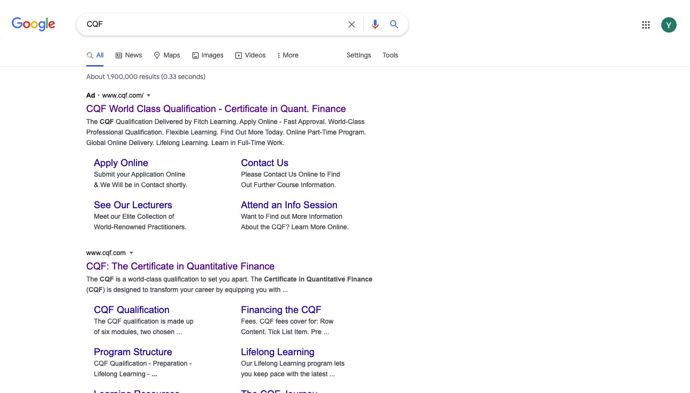
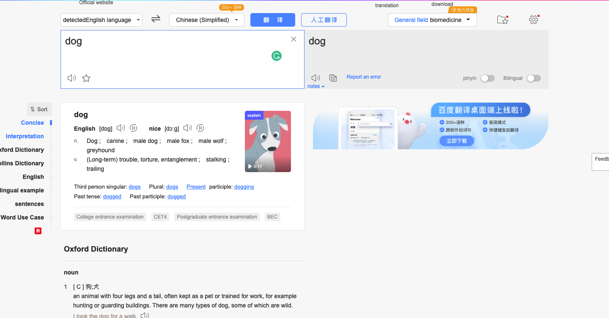
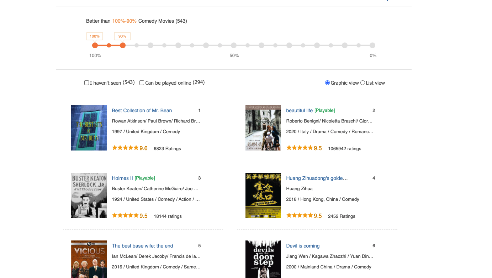

# Web-Crawler
First WebCrawler practice using python. 
The main purpose here is to get familiar with request package and perform some basic crawling  
  
  
**Task 1** is simply to acquire all the data on google page 

**Task 2** is simply to acquire all the data on google page 

**Task 3** is simply to acquire all the data on google page 

